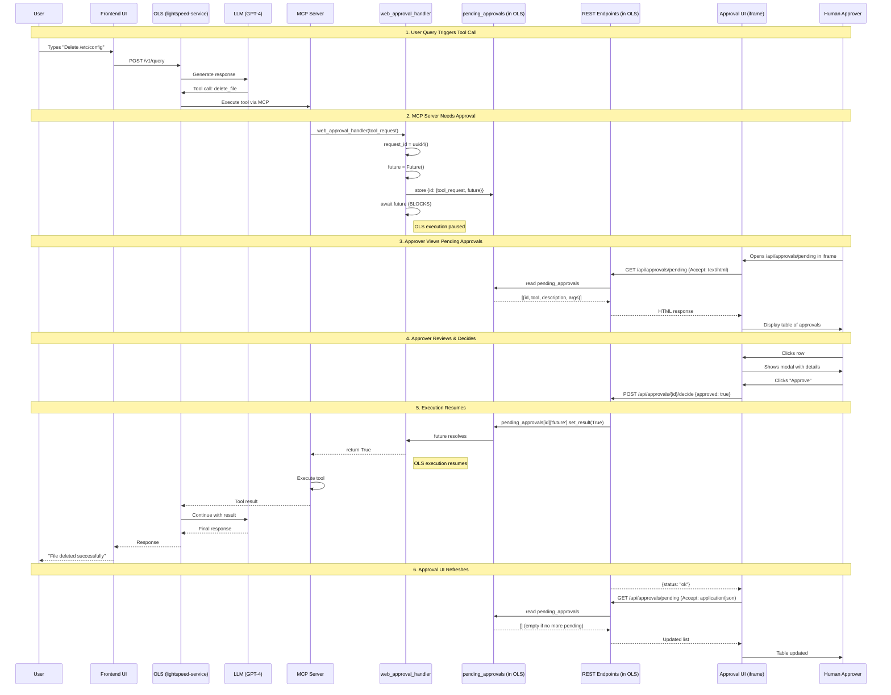

# Web-Based Approval System Design

## Table of Contents
1. [Architecture Overview](#architecture-overview)
2. [High-Level Description](#high-level-description)
3. [Sequence Diagram](#sequence-diagram)
4. [Implementation Details](#implementation-details)
5. [Complete Code](#complete-code)
6. [Integration Guide](#integration-guide)

---

## Architecture Overview

### System Components

```
┌─────────────────────────────────────────────────────────┐
│  Main Application (React/TypeScript Frontend)           │
│                                                          │
│  ┌────────────────────────────────────────────────────┐ │
│  │  <iframe src="/approvals/ui" />                    │ │
│  └────────────────────────────────────────────────────┘ │
└──────────────────────────┬──────────────────────────────┘
                           │ (HTTP)
                           ▼
┌──────────────────────────────────────────────────────────┐
│  lightspeed-service (FastAPI Backend)                    │
│                                                          │
│  ┌────────────────────────────────────────────────────┐ │
│  │  Existing REST Endpoints                           │ │
│  │  - POST /v1/query                                  │ │
│  │  - POST /v1/chat                                   │ │
│  └────────────────────────────────────────────────────┘ │
│                                                          │
│  ┌────────────────────────────────────────────────────┐ │
│  │  NEW: Approval REST Endpoints                      │ │
│  │  - GET  /api/approvals/pending  (HTML or JSON)     │ │
│  │  - POST /api/approvals/{id}/decide (submit)        │ │
│  └─────────────────┬──────────────────────────────────┘ │
│                    │                                     │
│  ┌─────────────────▼──────────────────────────────────┐ │
│  │  web_approval_handler.py                          │ │
│  │  - pending_approvals: Dict (shared state)         │ │
│  │  - web_approval_handler(tool_request) -> bool     │ │
│  └─────────────────▲──────────────────────────────────┘ │
│                    │                                     │
│  ┌─────────────────┴──────────────────────────────────┐ │
│  │  ols_approval_client.py                           │ │
│  │  - Makes tool calls                                │ │
│  │  - Calls web_approval_handler() when needed        │ │
│  └────────────────────────────────────────────────────┘ │
└──────────────────────────────────────────────────────────┘
```

### Key Design Decisions

1. **iframe Isolation**: Main app embeds approval UI in iframe
   - Minimal impact on main frontend (1 line of code)
   - Backend controls entire UI/UX
   - Easy to update without frontend deploy

2. **Shared In-Memory State**: `pending_approvals` dictionary
   - Simple, no external dependencies
   - Works for single-instance deployments
   - Can be replaced with Redis for multi-instance

3. **AsyncIO Futures for Blocking**: Handler blocks until approval
   - Clean async/await pattern
   - No polling needed in backend
   - Efficient resource usage

4. **Server-Rendered HTML**: Backend serves complete UI
   - No build step needed
   - All logic in one place
   - Easy to customize per deployment

---

## High-Level Description

### Problem Statement
When an MCP server needs to execute a dangerous tool (e.g., delete_file, send_email), it must obtain human approval before proceeding.

### Solution
A web-based approval system that:
1. Blocks MCP server execution when approval needed
2. Displays pending approvals in a user-friendly table
3. Allows users to approve/reject via web UI
4. Resumes MCP server execution after decision

### User Flow

1. **MCP server needs approval**
   - Server calls `web_approval_handler(tool_request)`
   - Handler creates Future and stores in `pending_approvals`
   - Handler blocks, waiting for user decision

2. **User views approvals**
   - Opens iframe: `/api/approvals/pending`
   - Sees table of pending approvals
   - Clicks row to open approval modal

3. **User makes decision**
   - Reviews tool details and arguments
   - Clicks "Approve" or "Reject"
   - Frontend POSTs decision to backend

4. **MCP server resumes**
   - Backend resolves Future with user's decision
   - Handler unblocks and returns to server
   - Server continues or stops based on decision

---

## Sequence Diagram



### Sequence Diagram (Text Format)

```
┌──────┐ ┌────┐ ┌─────┐ ┌─────┐ ┌─────┐ ┌─────────┐ ┌───────┐ ┌──────┐ ┌─────────┐ ┌─────────┐
│ User │ │ UI │ │ OLS │ │ LLM │ │ MCP │ │ Handler │ │ State │ │ API  │ │Approval │ │Approver │
│      │ │    │ │     │ │     │ │     │ │         │ │(OLS)  │ │(OLS) │ │UI(iframe)│ │         │
└───┬──┘ └─┬──┘ └──┬──┘ └──┬──┘ └──┬──┘ └────┬────┘ └───┬───┘ └───┬──┘ └────┬────┘ └────┬────┘
    │      │       │       │       │         │          │         │         │           │
    │query │       │       │       │         │          │         │         │           │
    ├─────>│       │       │       │         │          │         │         │           │
    │      │ POST  │       │       │         │          │         │         │           │
    │      │ /v1/  │       │       │         │          │         │         │           │
    │      │ query │       │       │         │          │         │         │           │
    │      ├──────>│       │       │         │          │         │         │           │
    │      │       │ LLM   │       │         │          │         │         │           │
    │      │       ├──────>│       │         │          │         │         │           │
    │      │       │       │ tool  │         │          │         │         │           │
    │      │       │       │ call  │         │          │         │         │           │
    │      │       │<──────┤       │         │          │         │         │           │
    │      │       │       │       │         │          │         │         │           │
    │      │       │ Execute tool  │         │          │         │         │           │
    │      │       ├──────────────>│         │          │         │         │           │
    │      │       │       │       │         │          │         │         │           │
    │      │       │       │       │ needs   │          │         │         │           │
    │      │       │       │       │ approval│          │         │         │           │
    │      │       │       │       ├────────>│          │         │         │           │
    │      │       │       │       │         │ create   │         │         │           │
    │      │       │       │       │         │ future   │         │         │           │
    │      │       │       │       │         ├─────────>│         │         │           │
    │      │       │       │       │         │          │ store   │         │           │
    │      │       │       │       │         │ await    │         │         │           │
    │      │       │       │       │         │ (BLOCKS) │         │         │           │
    │      │       │       │       │         │          │         │         │           │
    │      │       │ OLS PAUSED    │         │          │         │         │           │
    │      │       │       │       │         │          │         │         │           │
    │      │       │       │       │         │          │         │         │  opens    │
    │      │       │       │       │         │          │         │         │  iframe   │
    │      │       │       │       │         │          │         │         │<──────────┤
    │      │       │       │       │         │          │         │         │           │
    │      │       │       │       │         │          │         │  GET    │           │
    │      │       │       │       │         │          │         │  Accept:│           │
    │      │       │       │       │         │          │         │  html   │           │
    │      │       │       │       │         │          │         │<────────┤           │
    │      │       │       │       │         │          │         │         │           │
    │      │       │       │       │         │          │  read   │         │           │
    │      │       │       │       │         │          │<────────┤         │           │
    │      │       │       │       │         │          │         │         │           │
    │      │       │       │       │         │          │  data   │         │           │
    │      │       │       │       │         │          ├────────>│         │           │
    │      │       │       │       │         │          │         │         │           │
    │      │       │       │       │         │          │         │  HTML   │           │
    │      │       │       │       │         │          │         ├────────>│           │
    │      │       │       │       │         │          │         │         │           │
    │      │       │       │       │         │          │         │         │  display  │
    │      │       │       │       │         │          │         │         ├──────────>│
    │      │       │       │       │         │          │         │         │           │
    │      │       │       │       │         │          │         │         │  approve  │
    │      │       │       │       │         │          │         │         │<──────────┤
    │      │       │       │       │         │          │         │         │           │
    │      │       │       │       │         │          │         │  POST   │           │
    │      │       │       │       │         │          │         │  /decide│           │
    │      │       │       │       │         │          │         │<────────┤           │
    │      │       │       │       │         │          │         │         │           │
    │      │       │       │       │         │          │  set_   │         │           │
    │      │       │       │       │         │          │  result │         │           │
    │      │       │       │       │         │          │<────────┤         │           │
    │      │       │       │       │         │          │         │         │           │
    │      │       │       │       │         │  unblock │         │         │           │
    │      │       │       │       │         │<─────────┤         │         │           │
    │      │       │       │       │         │          │         │         │           │
    │      │       │       │       │  True   │          │         │         │           │
    │      │       │       │       │<────────┤          │         │         │           │
    │      │       │       │       │         │          │         │         │           │
    │      │       │ OLS RESUMES   │         │          │         │         │           │
    │      │       │       │       │         │          │         │         │           │
    │      │       │       │       │ execute │          │         │         │           │
    │      │       │       │       │ tool    │          │         │         │           │
    │      │       │       │       │         │          │         │         │           │
    │      │       │ result│       │         │          │         │         │           │
    │      │       │<──────────────┤         │          │         │         │           │
    │      │       │       │       │         │          │         │         │           │
    │      │       │ final │       │         │          │         │         │           │
    │      │       ├──────>│       │         │          │         │         │           │
    │      │       │       │       │         │          │         │         │           │
    │      │       │<──────┤       │         │          │         │         │           │
    │      │       │       │       │         │          │         │         │           │
    │      │ response      │       │         │          │         │         │           │
    │      │<──────┤       │       │         │          │         │         │           │
    │      │       │       │       │         │          │         │         │           │
    │<─────┤       │       │       │         │          │         │         │           │
    │ "Done"       │       │       │         │          │         │         │           │
    │      │       │       │       │         │          │         │         │           │
```

---

## Implementation Details

### 1. Shared State Management

**Location**: `web_approval_handler.py`

**Data Structure** (Multi-User Support):
```python
# Key: user_id, Value: list of pending approvals for that user
pending_approvals: Dict[str, List[Dict]] = {
    "user-alice": [
        {
            "request_id": "abc-123",
            "tool_request": ToolRequest(name="delete_file", ...),
            "future": asyncio.Future(),
            "created_at": datetime.now()
        }
    ],
    "user-bob": [
        {
            "request_id": "def-456",
            "tool_request": ToolRequest(name="send_email", ...),
            "future": asyncio.Future(),
            "created_at": datetime.now()
        }
    ]
}
```

**Lifecycle & Cleanup**:
- **Created**: When `web_approval_handler()` is called, new approval added to user's list
- **Read**: GET endpoint filters by authenticated user_id
- **Resolved**: POST endpoint sets Future result
- **Cleanup**: After Future resolves, approval is removed from user's list
  ```python
  # In web_approval_handler after await future:
  user_approvals = pending_approvals.get(user_id, [])
  user_approvals.remove(approval_dict)
  if not user_approvals:
      del pending_approvals[user_id]  # Clean up empty user list
  ```

This ensures `pending_approvals` always reflects current state - completed approvals are immediately removed.

**Isolation**: Direct lookup by `user_id` returns only that user's approvals.

**Key Points**:
- User ID comes from OLS auth system (`retrieve_user_id(auth)`)
- Available in both `/query` and `/streaming_query` endpoints
- Each user has their own list of pending approvals
- No duplicate `user_id` storage
- Multiple users can have pending approvals simultaneously without interference

**⚠️ Note for Demo Implementation**: 
The current demo code in this document does not include `user_id` filtering for simplicity. In production, add:
1. Pass `user_id` to `web_approval_handler()` 
2. Store with composite key: `f"{user_id}:{request_id}"`
3. Filter by `user_id` in GET `/api/approvals/pending` endpoint
4. This is a simple addition - just a few lines of code

**Lifecycle**:
- Created when handler is called (added to user's list)
- Read by GET endpoint (filtered by authenticated user_id)
- Modified by POST endpoint (resolves Future)
- Cleaned up immediately after resolution (removed from list to keep state current)

### 2. Approval Handler Pattern

**Signature**:
```python
async def web_approval_handler(tool_request: ToolRequest) -> bool
```

**Behavior**:
1. Generate unique request ID
2. Create asyncio.Future
3. Store in `pending_approvals[user_id]` list
4. Block on `await future`
5. Return result when Future resolves
6. **Clean up from `pending_approvals`** ← Critical!

**⚠️ Cleanup Integration (Not Yet Implemented)**

The cleanup needs to be added to ensure state stays current. Here's the integration pattern:

```python
async def web_approval_handler(
    tool_request: ToolRequest,
    user_id: str  # ← Need to pass user_id
) -> bool:
    """Web-based approval handler with cleanup."""
    
    # 1. Create approval
    request_id = str(uuid4())
    future = asyncio.Future()
    
    approval_dict = {
        "request_id": request_id,
        "tool_request": tool_request,
        "future": future,
        "created_at": datetime.now()
    }
    
    # 2. Store in user's list
    if user_id not in pending_approvals:
        pending_approvals[user_id] = []
    pending_approvals[user_id].append(approval_dict)
    
    try:
        # 3. Block until decision
        result = await future
        return result
        
    finally:
        # 4. CLEANUP - Always runs, even on timeout/exception
        user_approvals = pending_approvals.get(user_id, [])
        
        # Remove this specific approval from user's list
        pending_approvals[user_id] = [
            a for a in user_approvals 
            if a["request_id"] != request_id
        ]
        
        # Remove user key if no more approvals
        if not pending_approvals[user_id]:
            del pending_approvals[user_id]
        
        logger.debug(
            "Cleaned up approval %s for user %s", 
            request_id, 
            user_id
        )
```

**Why `finally` block?**
- Guarantees cleanup even if timeout occurs
- Handles exceptions gracefully
- Prevents memory leaks from abandoned approvals

**TODO for Integration:**
1. Modify `web_approval_handler()` signature to accept `user_id`
2. Update call sites in `ols_approval_client.py` to pass `user_id`
3. Add the `finally` block with cleanup logic above

### 3. REST Endpoints

#### GET `/api/approvals/pending`
- **Purpose**: Serve HTML iframe OR return JSON data (content negotiation)
- **Request Headers**: 
  - `Accept: text/html` → Returns complete HTML page
  - `Accept: application/json` OR no Accept header → Returns JSON
- **Response (HTML)**: Complete HTML page with embedded JavaScript
- **Response (JSON)**: JSON with data and UI spec
- **Usage**: 
  - iframe initial load: `<iframe src="/api/approvals/pending">`
  - JavaScript reload: `fetch('/api/approvals/pending')`

#### POST `/api/approvals/{request_id}/decide`
- **Purpose**: Submit approval decision
- **Request Body**: `{"approved": true|false}`
- **Side Effect**: Resolves Future in `pending_approvals`

### 4. Frontend Architecture

**Technology**: Vanilla JavaScript (no framework)

**Components**:
- **Table**: Displays pending approvals
- **Modal**: Shows approval details
- **Buttons**: Approve/Reject/Cancel/Reload

**Event Flow**:
1. `loadApprovals()` - Fetches and renders table
2. Row click → `openModal()` - Shows details
3. Button click → `handleDecision()` - Submits and reloads

---

## Complete Code

### File 1: `web_approval_handler.py`

```python
"""Web-based approval handler for HTTP/iframe-based approvals.

This module provides an approval handler that uses a web UI instead of CLI.
Approvals are displayed in an iframe and submitted via REST API.
"""

import asyncio
import logging
from datetime import datetime
from typing import Dict
from uuid import uuid4

from approvals import ToolRequest

logger = logging.getLogger(__name__)

# Shared in-memory state
# In production, replace with Redis or similar for multi-instance support
pending_approvals: Dict[str, Dict] = {}


async def web_approval_handler(tool_request: ToolRequest) -> bool:
    """Web-based approval handler.
    
    Creates an approval request, stores it in shared memory, and blocks
    until a decision is made via the web UI.
    
    Args:
        tool_request: Tool call requiring approval
        
    Returns:
        bool: True if approved, False if rejected
        
    Example:
        config = ToolLevelApprovalConfig(
            approval_ui_handler=web_approval_handler
        )
        approval = ToolLevelApproval(config)
    """
    # Generate unique request ID
    request_id = str(uuid4())
    
    # Create Future that will block until resolved
    future: asyncio.Future[bool] = asyncio.Future()
    
    # Store in shared memory
    pending_approvals[request_id] = {
        'tool_request': tool_request,
        'future': future,
        'created_at': datetime.now()
    }
    
    logger.info(
        "Approval required for %s (request_id=%s). "
        "Waiting for decision via web UI...",
        tool_request.name,
        request_id
    )
    
    try:
        # Block until decision is made
        result = await future
        logger.info(
            "Approval %s: %s",
            "granted" if result else "denied",
            tool_request.name
        )
        return result
    finally:
        # Cleanup
        pending_approvals.pop(request_id, None)


def get_pending_approvals() -> list[dict]:
    """Get list of pending approvals for API endpoint.
    
    Returns:
        List of approval data dictionaries
    """
    return [
        {
            "id": request_id,
            "tool": data['tool_request'].name,
            "description": data['tool_request'].description,
            "args": data['tool_request'].args,
            "created_at": data['created_at'].isoformat()
        }
        for request_id, data in pending_approvals.items()
    ]


def resolve_approval(request_id: str, approved: bool) -> bool:
    """Resolve a pending approval request.
    
    Args:
        request_id: ID of the approval request
        approved: True to approve, False to reject
        
    Returns:
        bool: True if request was found and resolved, False otherwise
    """
    if request_id not in pending_approvals:
        logger.warning("Approval request not found: %s", request_id)
        return False
    
    # Resolve the Future - this unblocks web_approval_handler
    pending_approvals[request_id]['future'].set_result(approved)
    logger.info("Resolved approval %s: %s", request_id, approved)
    return True
```

### File 2: `approval_endpoints.py`

```python
"""FastAPI endpoints for web-based approval system.

This module provides REST endpoints for the approval UI iframe.
Single endpoint uses content negotiation to return HTML or JSON.
"""

from fastapi import APIRouter, HTTPException, Header
from fastapi.responses import HTMLResponse
from pydantic import BaseModel
from typing import Optional

from web_approval_handler import get_pending_approvals, resolve_approval

router = APIRouter()


class ApprovalDecision(BaseModel):
    """Request body for approval decision."""
    approved: bool


@router.get("/pending")
async def get_pending(accept: Optional[str] = Header(None)):
    """Get pending approvals - returns HTML or JSON based on Accept header.
    
    Content Negotiation:
    - Accept: text/html → Returns complete HTML page for iframe
    - Accept: application/json OR no header → Returns JSON data
    
    This allows a single endpoint to serve both:
    1. Initial iframe load (browser sends Accept: text/html)
    2. JavaScript data refresh (fetch sends Accept: application/json)
    
    Args:
        accept: Accept header from request
        
    Returns:
        HTMLResponse: Complete HTML page (for iframe)
        OR
        JSON: Data with UI spec (for JavaScript)
    """
    # Check if HTML is requested (browser/iframe)
    if accept and "text/html" in accept:
        return HTMLResponse("""
    <!DOCTYPE html>
    <html>
    <head>
        <title>Pending Approvals</title>
        <meta charset="UTF-8">
        <meta name="viewport" content="width=device-width, initial-scale=1.0">
        <style>
            * { box-sizing: border-box; margin: 0; padding: 0; }
            body { 
                font-family: -apple-system, BlinkMacSystemFont, 'Segoe UI', Roboto, 
                             'Helvetica Neue', Arial, sans-serif;
                padding: 20px;
                background: #f5f5f5;
            }
            .container {
                max-width: 1200px;
                margin: 0 auto;
                background: white;
                border-radius: 8px;
                padding: 20px;
                box-shadow: 0 2px 4px rgba(0,0,0,0.1);
            }
            .header {
                display: flex;
                justify-content: space-between;
                align-items: center;
                margin-bottom: 20px;
                padding-bottom: 15px;
                border-bottom: 2px solid #e0e0e0;
            }
            h1 {
                font-size: 24px;
                color: #333;
            }
            .reload-btn {
                padding: 8px 16px;
                background: #007bff;
                color: white;
                border: none;
                border-radius: 4px;
                cursor: pointer;
                font-size: 14px;
                display: flex;
                align-items: center;
                gap: 5px;
                transition: background 0.2s;
            }
            .reload-btn:hover { background: #0056b3; }
            .reload-btn:active { transform: scale(0.98); }
            
            table {
                width: 100%;
                border-collapse: collapse;
                margin-bottom: 20px;
            }
            th, td {
                padding: 12px;
                text-align: left;
                border-bottom: 1px solid #e0e0e0;
            }
            th {
                background: #f8f9fa;
                font-weight: 600;
                color: #555;
                font-size: 14px;
            }
            tr:hover {
                background: #f9f9f9;
                cursor: pointer;
            }
            td {
                font-size: 14px;
                color: #333;
            }
            .empty-state {
                text-align: center;
                color: #999;
                padding: 40px;
                font-style: italic;
            }
            
            .overlay {
                display: none;
                position: fixed;
                top: 0;
                left: 0;
                width: 100%;
                height: 100%;
                background: rgba(0, 0, 0, 0.5);
                z-index: 999;
            }
            .modal {
                display: none;
                position: fixed;
                top: 50%;
                left: 50%;
                transform: translate(-50%, -50%);
                background: white;
                padding: 24px;
                border-radius: 8px;
                box-shadow: 0 4px 20px rgba(0,0,0,0.15);
                z-index: 1000;
                min-width: 500px;
                max-width: 90%;
                max-height: 80vh;
                overflow-y: auto;
            }
            .modal h2 {
                margin-bottom: 20px;
                color: #333;
                font-size: 20px;
            }
            .modal-content p {
                margin-bottom: 15px;
                line-height: 1.5;
            }
            .modal-content strong {
                color: #555;
            }
            .modal-content pre {
                background: #f4f4f4;
                padding: 12px;
                border-radius: 4px;
                overflow-x: auto;
                font-size: 13px;
                line-height: 1.4;
            }
            
            .btn-group {
                margin-top: 24px;
                display: flex;
                gap: 10px;
                justify-content: flex-end;
            }
            .btn {
                padding: 10px 20px;
                border: none;
                border-radius: 4px;
                cursor: pointer;
                font-size: 14px;
                font-weight: 500;
                transition: all 0.2s;
            }
            .btn-approve {
                background: #28a745;
                color: white;
            }
            .btn-approve:hover { background: #218838; }
            .btn-reject {
                background: #dc3545;
                color: white;
            }
            .btn-reject:hover { background: #c82333; }
            .btn-cancel {
                background: #6c757d;
                color: white;
            }
            .btn-cancel:hover { background: #5a6268; }
            .btn:active { transform: scale(0.98); }
        </style>
    </head>
    <body>
        <div class="container">
            <div class="header">
                <h1>🚨 Pending Approvals</h1>
                <button class="reload-btn" onclick="loadApprovals()">
                    🔄 Reload
                </button>
            </div>
            
            <table id="approvals-table">
                <thead>
                    <tr>
                        <th>Tool</th>
                        <th>Description</th>
                        <th>Time</th>
                    </tr>
                </thead>
                <tbody id="approvals-body">
                    <tr><td colspan="3" class="empty-state">Loading...</td></tr>
                </tbody>
            </table>
        </div>

        <div class="overlay" id="overlay" onclick="closeModal()"></div>
        <div class="modal" id="approval-modal">
            <h2 id="modal-title"></h2>
            <div class="modal-content" id="modal-content"></div>
            <div class="btn-group">
                <button class="btn btn-approve" onclick="handleDecision(true)">
                    ✅ Approve
                </button>
                <button class="btn btn-reject" onclick="handleDecision(false)">
                    ❌ Reject
                </button>
                <button class="btn btn-cancel" onclick="closeModal()">
                    Cancel
                </button>
            </div>
        </div>

        <script>
            let currentApprovalId = null;
            let currentApproval = null;

            // Load approvals from API
            async function loadApprovals() {
                try {
                    const response = await fetch('/api/approvals/pending');
                    const data = await response.json();
                    
                    const tbody = document.getElementById('approvals-body');
                    tbody.innerHTML = '';
                    
                    if (data.data && data.data.length > 0) {
                        data.data.forEach(approval => {
                            const row = tbody.insertRow();
                            row.onclick = () => openModal(approval);
                            row.insertCell(0).textContent = approval.tool;
                            row.insertCell(1).textContent = approval.description;
                            
                            // Format timestamp
                            const time = new Date(approval.created_at);
                            row.insertCell(2).textContent = time.toLocaleString();
                        });
                    } else {
                        tbody.innerHTML = '<tr><td colspan="3" class="empty-state">No pending approvals</td></tr>';
                    }
                } catch (error) {
                    console.error('Failed to load approvals:', error);
                    document.getElementById('approvals-body').innerHTML = 
                        '<tr><td colspan="3" class="empty-state">Error loading approvals</td></tr>';
                }
            }

            // Open approval modal with details
            function openModal(approval) {
                currentApprovalId = approval.id;
                currentApproval = approval;
                
                document.getElementById('modal-title').textContent = 
                    `Approve ${approval.tool}?`;
                
                document.getElementById('modal-content').innerHTML = `
                    <p><strong>Tool:</strong> ${approval.tool}</p>
                    <p><strong>Description:</strong> ${approval.description}</p>
                    <p><strong>Arguments:</strong></p>
                    <pre>${JSON.stringify(approval.args, null, 2)}</pre>
                    <p><strong>Requested at:</strong> ${new Date(approval.created_at).toLocaleString()}</p>
                `;
                
                document.getElementById('overlay').style.display = 'block';
                document.getElementById('approval-modal').style.display = 'block';
            }

            // Close modal
            function closeModal() {
                document.getElementById('overlay').style.display = 'none';
                document.getElementById('approval-modal').style.display = 'none';
                currentApprovalId = null;
                currentApproval = null;
            }

            // Handle approve/reject decision
            async function handleDecision(approved) {
                if (!currentApprovalId) return;
                
                try {
                    const response = await fetch(
                        `/api/approvals/${currentApprovalId}/decide`,
                        {
                            method: 'POST',
                            headers: {
                                'Content-Type': 'application/json'
                            },
                            body: JSON.stringify({ approved: approved })
                        }
                    );
                    
                    if (response.ok) {
                        closeModal();
                        // Reload table to show updated list
                        await loadApprovals();
                    } else {
                        alert('Failed to submit decision. Please try again.');
                    }
                } catch (error) {
                    console.error('Failed to submit decision:', error);
                    alert('Failed to submit decision. Please try again.');
                }
            }

            // Initial load
            loadApprovals();
            
            // Optional: Auto-refresh every 5 seconds
            // Uncomment if you want automatic polling
            // setInterval(loadApprovals, 5000);
        </script>
    </body>
    </html>
    """)
    
    # Otherwise return JSON (for JavaScript fetch)
    approvals = get_pending_approvals()
    
    return {
        "data": approvals,
        "ui": {
            "type": "approval_table",
            "title": "Pending Approvals",
            "columns": [
                {"key": "tool", "label": "Tool", "type": "text"},
                {"key": "description", "label": "Description", "type": "text"},
                {"key": "created_at", "label": "Time", "type": "datetime"}
            ],
            "actions": {
                "row_click": "open_modal",
                "modal": {
                    "title_template": "Approve {tool}?",
                    "fields": [
                        {"key": "tool", "label": "Tool"},
                        {"key": "description", "label": "Description"},
                        {"key": "args", "label": "Arguments", "type": "json"}
                    ],
                    "buttons": [
                        {
                            "label": "Approve",
                            "action": "approve",
                            "style": "primary",
                            "endpoint": {
                                "method": "POST",
                                "url": "/api/approvals/{id}/decide",
                                "body": {"approved": True}
                            },
                            "on_complete": {
                                "action": "reload_table",
                                "endpoint": {
                                    "method": "GET",
                                    "url": "/api/approvals/pending"
                                }
                            }
                        },
                        {
                            "label": "Reject",
                            "action": "reject",
                            "style": "danger",
                            "endpoint": {
                                "method": "POST",
                                "url": "/api/approvals/{id}/decide",
                                "body": {"approved": False}
                            },
                            "on_complete": {
                                "action": "reload_table",
                                "endpoint": {
                                    "method": "GET",
                                    "url": "/api/approvals/pending"
                                }
                            }
                        }
                    ]
                }
            }
        }
    }


@router.post("/{request_id}/decide")
async def submit_decision(request_id: str, decision: ApprovalDecision):
    """Submit approval decision for a pending request.
    
    Args:
        request_id: ID of the approval request
        decision: Approval decision (approved: true/false)
        
    Returns:
        Status response
        
    Raises:
        HTTPException: If request_id not found
    """
    success = resolve_approval(request_id, decision.approved)
    
    if not success:
        raise HTTPException(
            status_code=404,
            detail=f"Approval request not found: {request_id}"
        )
    
    return {
        "status": "ok",
        "request_id": request_id,
        "decision": "approved" if decision.approved else "rejected"
    }
```

### File 3: Integration into lightspeed-service

```python
# In lightspeed-service/main.py

from fastapi import FastAPI
from approval_endpoints import router as approval_router

app = FastAPI()

# Your existing routes
@app.post("/v1/query")
async def query_endpoint():
    pass

@app.post("/v1/chat")
async def chat_endpoint():
    pass

# Add approval endpoints
app.include_router(
    approval_router,
    prefix="/api/approvals",
    tags=["approvals"]
)
```

### File 4: Configure approval in ols_approval_client

```python
# In ols_approval_client.py or wherever you configure approvals

from web_approval_handler import web_approval_handler
from approvals import ToolLevelApprovalConfig, ToolLevelApproval

# Configure to use web handler instead of CLI
config = ToolLevelApprovalConfig(
    approval_ui_handler=web_approval_handler,
    approval_timeout=300,  # 5 minutes (longer for web UI)
    dangerous_verbs=[
        "delete", "remove", "drop", "truncate",
        "destroy", "kill", "terminate", "execute"
    ]
)

approval = ToolLevelApproval(config)

# Use in your client
client = OLSApprovalClient(
    mcp_url="http://localhost:3000",
    llm=ChatOpenAI(model="gpt-4"),
    approval=approval
)
```

---

## Integration Guide

### Step 1: Add Files to Project

```bash
lightspeed-service/
├── web_approval_handler.py      # NEW
├── approval_endpoints.py         # NEW
├── main.py                       # MODIFY
└── ols_approval_client.py        # MODIFY
```

### Step 2: Install Dependencies

No new dependencies required! Uses existing:
- `fastapi`
- `pydantic`
- `asyncio` (standard library)

### Step 3: Update Configuration

In your approval configuration:

```python
# Before (CLI handler)
from cli_handler import default_cli_approval_handler
config = ToolLevelApprovalConfig(
    approval_ui_handler=default_cli_approval_handler
)

# After (Web handler)
from web_approval_handler import web_approval_handler
config = ToolLevelApprovalConfig(
    approval_ui_handler=web_approval_handler,
    approval_timeout=300  # Longer timeout for web UI
)
```

### Step 4: Add Endpoints to FastAPI

In `main.py`:

```python
from approval_endpoints import router as approval_router

app.include_router(
    approval_router,
    prefix="/api/approvals"
)
```

### Step 5: Embed iframe in Frontend

In your React/TypeScript frontend:

```tsx
// In your main app component
<div className="approval-panel">
  <iframe 
    src="http://localhost:8000/api/approvals/pending"
    width="100%"
    height="600px"
    style={{ border: '1px solid #ddd', borderRadius: '8px' }}
  />
</div>
```

---

### Enhanced UX: Conditional iframe Display (Recommended)

For better user experience, show the iframe only when approvals are pending:

#### Pattern: Hidden iframe with Smart Polling

```tsx
import { useEffect, useState } from 'react';

export function ApprovalPanel() {
  const [hasApprovals, setHasApprovals] = useState(false);
  const [isPolling, setIsPolling] = useState(true);

  useEffect(() => {
    let interval: NodeJS.Timeout;

    const checkForApprovals = async () => {
      try {
        const response = await fetch('/api/approvals/pending', {
          headers: { 'Accept': 'application/json' }
        });
        const data = await response.json();
        
        const hasPending = data.data && data.data.length > 0;
        
        if (hasPending && !hasApprovals) {
          // Approvals appeared - show iframe and stop polling
          setHasApprovals(true);
          setIsPolling(false);
          clearInterval(interval);
        } else if (!hasPending && hasApprovals) {
          // Table emptied - hide iframe and resume polling
          setHasApprovals(false);
          setIsPolling(true);
          startPolling();
        }
      } catch (error) {
        console.error('Failed to check approvals:', error);
      }
    };

    const startPolling = () => {
      interval = setInterval(checkForApprovals, 2000); // Poll every 2 seconds
    };

    if (isPolling) {
      startPolling();
    }

    return () => clearInterval(interval);
  }, [hasApprovals, isPolling]);

  return (
    <div className="approval-panel">
      {hasApprovals ? (
        <iframe 
          src="http://localhost:8000/api/approvals/pending"
          width="100%"
          height="600px"
          style={{ 
            border: '1px solid #ddd', 
            borderRadius: '8px',
            display: 'block' 
          }}
        />
      ) : (
        <div style={{ display: 'none' }} />
      )}
    </div>
  );
}
```

#### Flow:

1. **Initial State**: iframe hidden, background polling every 2 seconds
2. **Approvals Appear**: 
   - Polling detects `data.length > 0`
   - Show iframe with approval table
   - Stop polling (user is actively viewing)
3. **User Approves/Rejects**:
   - iframe's JavaScript reloads table
   - Table becomes empty
4. **Table Empty**:
   - Parent component detects `data.length === 0`
   - Hide iframe
   - Resume background polling

**Benefits**:
- ✅ Clean UI - no empty table shown
- ✅ Efficient - polling only when hidden
- ✅ Responsive - appears immediately when needed
- ✅ Auto-hides when done

---

### Step 6: Test the Flow

1. Start lightspeed-service: `uvicorn main:app --reload`
2. Trigger an action requiring approval
3. Open frontend with iframe
4. Verify approval appears in table
5. Click row, approve/reject
6. Verify agent resumes correctly

### Production Considerations

#### Multi-Instance Deployment

Replace in-memory dict with Redis:

```python
# web_approval_handler.py
import redis
import pickle

redis_client = redis.Redis(host='localhost', port=6379)

def store_approval(request_id: str, data: dict):
    redis_client.setex(
        f"approval:{request_id}",
        timedelta(minutes=10),
        pickle.dumps(data)
    )

def get_approval(request_id: str) -> dict:
    data = redis_client.get(f"approval:{request_id}")
    return pickle.loads(data) if data else None
```

#### Security

1. **Authentication**: Add auth middleware
2. **CORS**: Configure for iframe embedding
3. **Rate Limiting**: Prevent abuse
4. **Audit Logging**: Track all decisions

```python
from fastapi.middleware.cors import CORSMiddleware

app.add_middleware(
    CORSMiddleware,
    allow_origins=["https://your-frontend.com"],
    allow_credentials=True,
    allow_methods=["*"],
    allow_headers=["*"],
)
```

#### Monitoring

```python
import prometheus_client as prom

approval_counter = prom.Counter(
    'approvals_total',
    'Total approval requests',
    ['status']
)

# In resolve_approval:
approval_counter.labels(status='approved' if approved else 'rejected').inc()
```

---

## Advantages of This Approach

1. **Minimal Frontend Impact**
   - Single iframe embed
   - No TypeScript/React code needed
   - Backend controls entire UI

2. **Simple Backend**
   - No MCP protocol complexity
   - Plain REST endpoints
   - Easy to understand and debug

3. **Flexible**
   - Easy to customize UI
   - Can add more features without frontend deploy
   - UI spec allows future enhancements

4. **Production Ready**
   - Can scale with Redis
   - Easy to add auth/monitoring
   - Clean separation of concerns

---

## Testing

### Manual Test

```bash
# Terminal 1: Start server
cd lightspeed-service
uvicorn main:app --reload

# Terminal 2: Trigger approval
curl -X POST http://localhost:8000/v1/query \
  -H "Content-Type: application/json" \
  -d '{"query": "Delete /etc/config"}'

# Terminal 3: Check pending approvals (JSON)
curl http://localhost:8000/api/approvals/pending

# Browser: Open iframe (HTML)
open http://localhost:8000/api/approvals/pending
```

### Unit Tests

```python
# test_web_approval.py
import pytest
from web_approval_handler import (
    web_approval_handler,
    get_pending_approvals,
    resolve_approval,
    pending_approvals
)
from approvals import ToolRequest

@pytest.fixture
def clear_approvals():
    pending_approvals.clear()
    yield
    pending_approvals.clear()

@pytest.mark.asyncio
async def test_web_approval_blocks_until_decision(clear_approvals):
    tool_request = ToolRequest(
        name="delete_file",
        description="Delete a file",
        args={"path": "/etc/config"}
    )
    
    # Start handler (it will block)
    import asyncio
    task = asyncio.create_task(web_approval_handler(tool_request))
    
    # Give it time to store in pending_approvals
    await asyncio.sleep(0.1)
    
    # Check it's pending
    pending = get_pending_approvals()
    assert len(pending) == 1
    request_id = pending[0]['id']
    
    # Approve it
    resolve_approval(request_id, True)
    
    # Handler should unblock and return True
    result = await task
    assert result is True
    
    # Should be cleaned up
    assert len(get_pending_approvals()) == 0
```

---

## FAQ

**Q: What happens if user never responds?**
A: The `approval_timeout` in config will cause the Future to timeout (handled by `approvals.py`'s `call_with_timeout`), defaulting to rejection.

**Q: Can multiple users approve simultaneously?**
A: Yes, but first approval wins (Future can only be resolved once).

**Q: Does this work with multiple backend instances?**
A: In-memory version: No. Use Redis for multi-instance deployments.

**Q: How do I customize the UI?**
A: Edit the HTML in `approval_endpoints.py` GET `/ui` endpoint.

**Q: Can I use a separate frontend app instead of iframe?**
A: Yes! The endpoint works standalone. Your custom UI just needs to call `/api/approvals/pending` (with `Accept: application/json` header) and POST to `/decide`.

---

## Summary

This design provides a clean, simple web-based approval system with:

- ✅ Minimal frontend impact (1 line iframe embed)
- ✅ **Single GET endpoint** (content negotiation: HTML or JSON)
- ✅ Server-rendered UI (no build step)
- ✅ Async/await blocking pattern (efficient)
- ✅ Production-ready (can add Redis, auth, monitoring)
- ✅ Easy to test and debug
- ✅ Clean REST API design

The iframe approach with content negotiation gives you full control over the approval UX while keeping the main application code unchanged. The same endpoint serves both initial HTML load and subsequent JSON updates.
